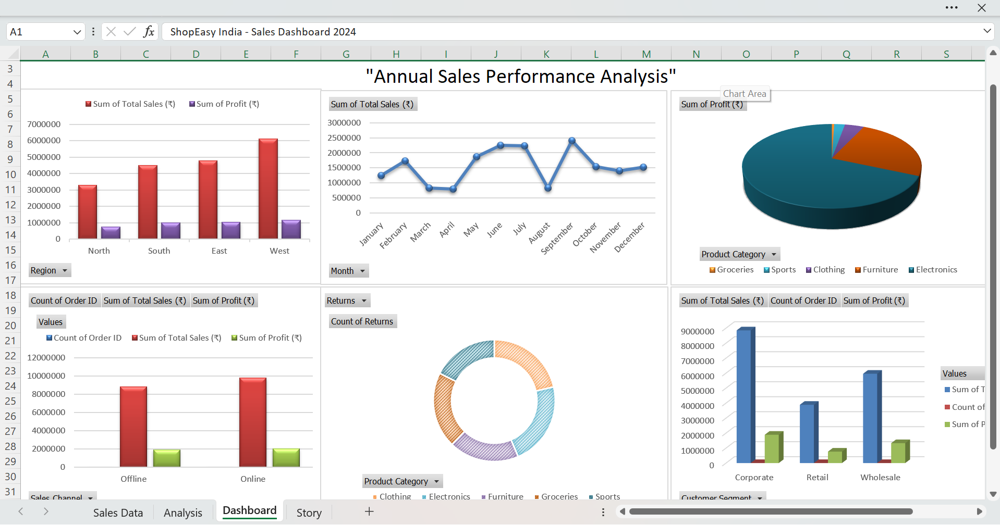

# 🛒 ShopEasy India — Retail Sales Analysis

##  Project Overview
Analyzed 500 orders of ShopEasy India retail company 
to identify sales trends, profitability gaps, and 
business recommendations.

##  Tools Used
- Microsoft Excel
- Pivot Tables
- Excel Dashboard with Slicers

##  Business Questions Solved
- Which region generates highest sales?
- Which product category is most profitable?
- Online vs Offline channel performance
- Impact of discounts on profit
- Monthly sales trend analysis
- Customer segment contribution
- Return rate by category

##  Dashboard Preview

##  Key Insights
- North region leads in sales
- Electronics has highest revenue but lowest margin
- Online channel outperforms Offline in profit
- High discounts are hurting profitability

##  Author
Sahil Srivastava | PGDM — Business Analytics & HR
